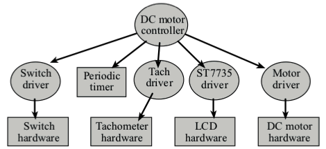
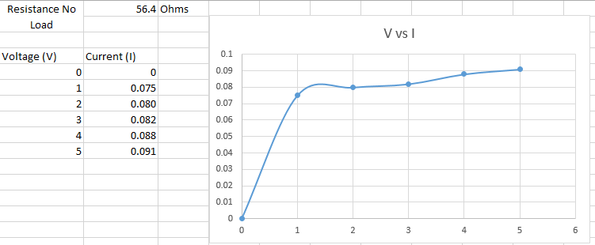
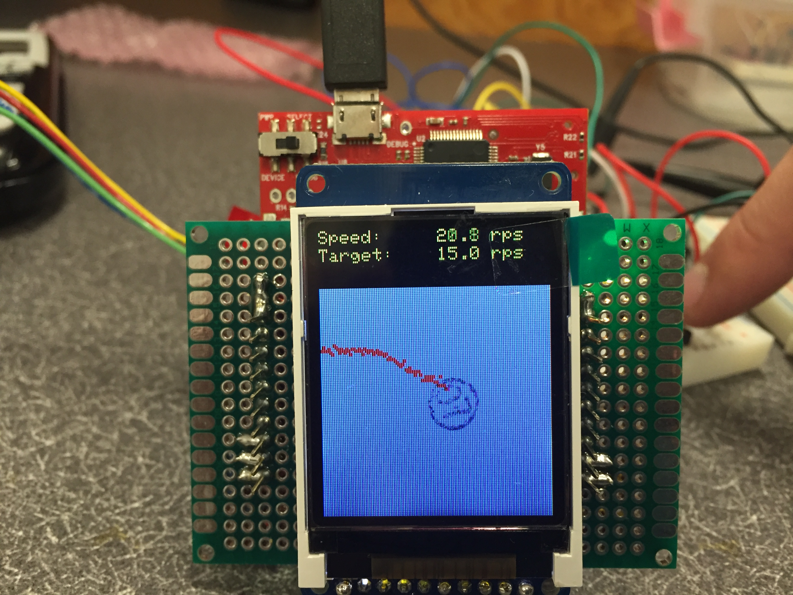
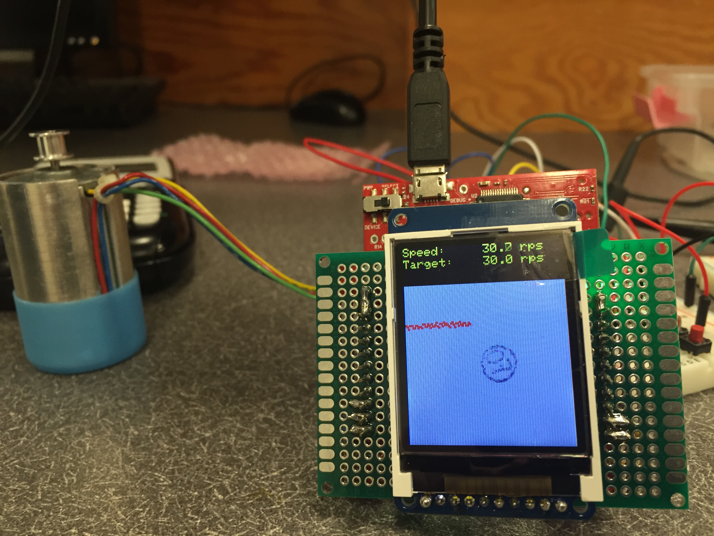
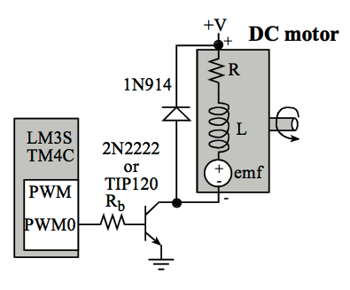

# Lab 10: DC Motor Control

## Objectives

We will spin a brushed DC motor at a constant speed using an integral controller. Two switches will allow the operator to increase or decrease the desired speed. A tachometer will be used to measure the motor speed. A background periodic interrupt will execute the three steps of a digital controller.

Additionally we will calculate error as the difference between actual and desired speed, execute a control equation to determine the next output, and adjust the power to the actuator in an attempt to drive the error to zero.

See our [requirements doc](Requirements.md).

## Hardware Design

DC Motor interface design. PB7 PWM output net shown on the left side, and PB6 tachometer input net shown on the right side.

Button and display interface design.

## Software Design

Data flows from the tachometer and from the switches to the DC motor and to the LCD.

A call graph showing the modules used by the DC motor controller.

## Measurement Data

1. 
2. Ibe = 0.00378 A, Ice = 0.084 A
3.  
4. Maximum ISR Time is 2.05 us. Average Controller Error is 0.3 rps. Average responce time 1.8 sec.
5. Maximum Current is 0.073A, minimum current is 0.001A.

## Analysis and Discussion

1. Torque - The tendency of a force to rotate an object about an axis, fulcrum, or pivot. Just as a force is a push or a pull, a torque can be thought of as a twist to an object. It is units of Newton-meters or N•m

2. 

The DC motor is modeled as a resistor in series with an inductor. When a load is placed on the motor, the shaft spins slower due to friction. As a consequence, the coil that is engaged in the motor is energized for a longer period of time. Because inductors act as electrical shorts the longer they are powered with a DC supply, the inductor draws more current and thus the motor draws more current.

3. Current to drive the motor was the most important parameter. We had to chose the TIP120 because the 2N2222 did not provide enough current gain for the motor. The interface from the TM4C provides enough base current to the TIP120 to drive the motor.

4. Direct Motor Control. We could have just calculated the PWM nescessary for each speed and set it accordingly. It would have removed jitter from the motor speed.

5. The motor is not quite spinning at a constant rate but is close. Electrical power in this lab is Volts * Amps and is given in unit Watts. For a motor, it's power is given as Torque * Angular Velocity and is also given in unit Watts. Because both electrical power and mechanical power is given in Watts, the two are linearly related with some slight power loss due to friction.

