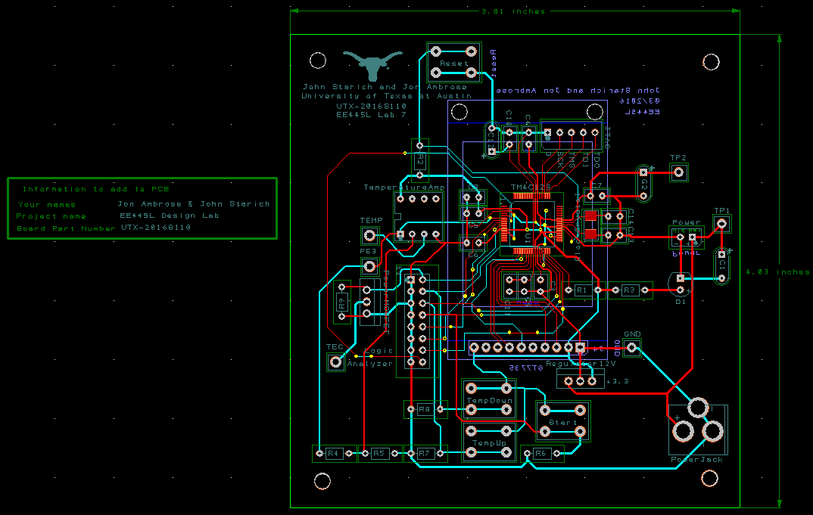
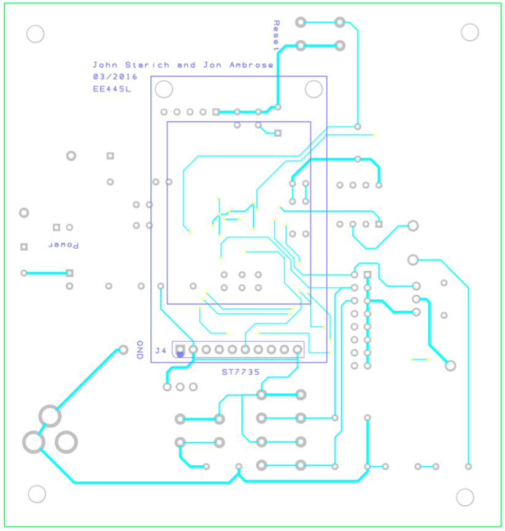

# Lab 11: Final Embedded System

## Objectives

We completed the embedded system we began in Lab 7. This lab included hardware construction, software debugging, and system evaluation.

See our [requirements file](Requirements.md).

## Hardware Design

Top Copper

Bottom Copper

## Software Design

Our system takes three buttons as input. The switch on the left below the display enables and disables the cooling unit. The two switches on the right below the display let the user set the desired temperature for the cooler to drop the temperature to.

The buttons are controlled using timer based triggers, the thermoelectric coolers are enabled and disabled via a power MOSFET connected to a GPIO pin, and the display is interfaced to an SSI on the TM4C123 processor.

The buttons module controls the timer initialization as well as the time-based button press control. The button actions are called from inside this module to other modules' code. The buttons used Timer1 every 1ms.

The ADC module controlled the initialization and sampling of the ADC at x64 hardware averaging. The ADC sampling was run using the SysTick handler every 10 milliseconds.

The coolers (TEC) module controlled the initialization of the GPIO output pin to the power MOSFET, which enabled and disabled the cooler pads.

The Main module initialized each of its submodules and ran the display code such that the desired and current temperature were displayed on the LCD screen.

## Measurement Data

## Video

<a href="http://www.youtube.com/watch?feature=player_embedded&v=gIcv6PLDJF4" target="_blank">
  
   
  https://youtu.be/gIcv6PLDJF4
</a>
