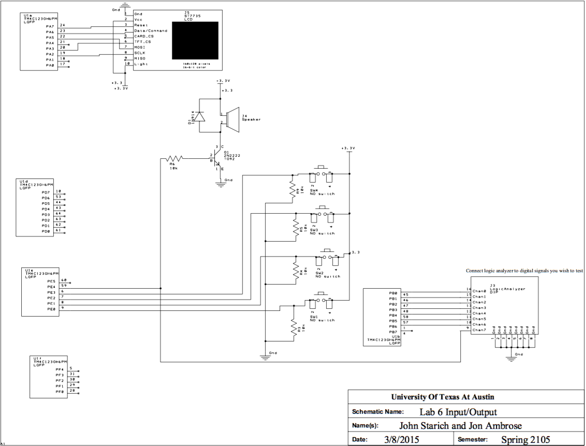
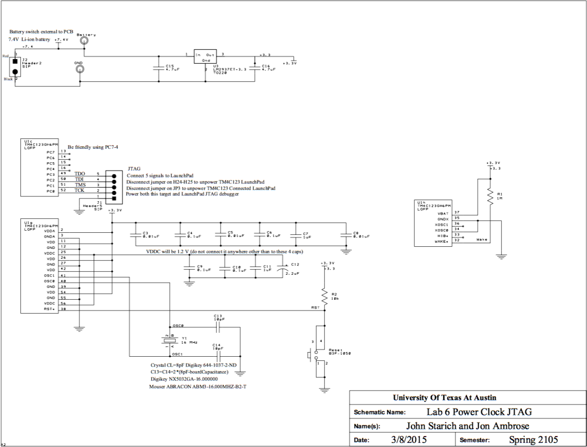
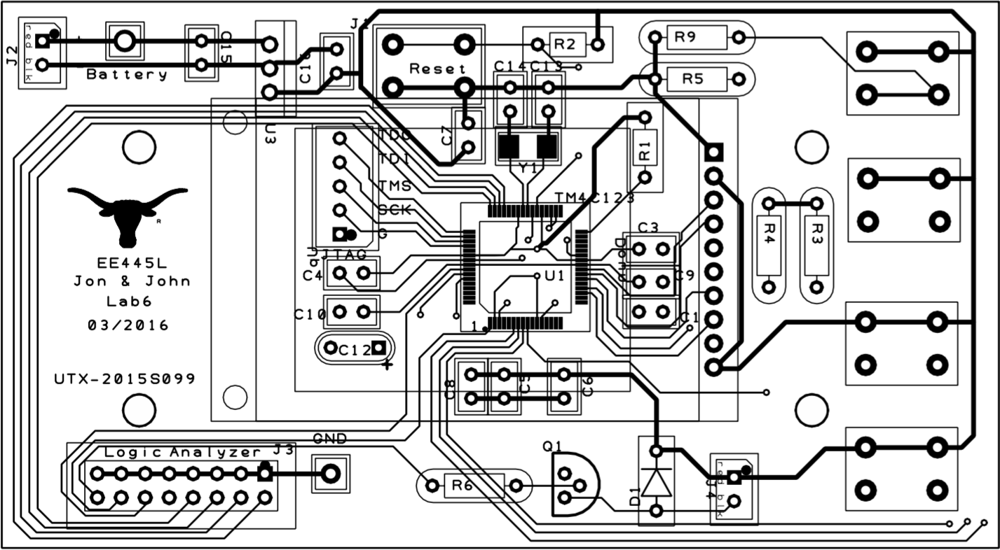
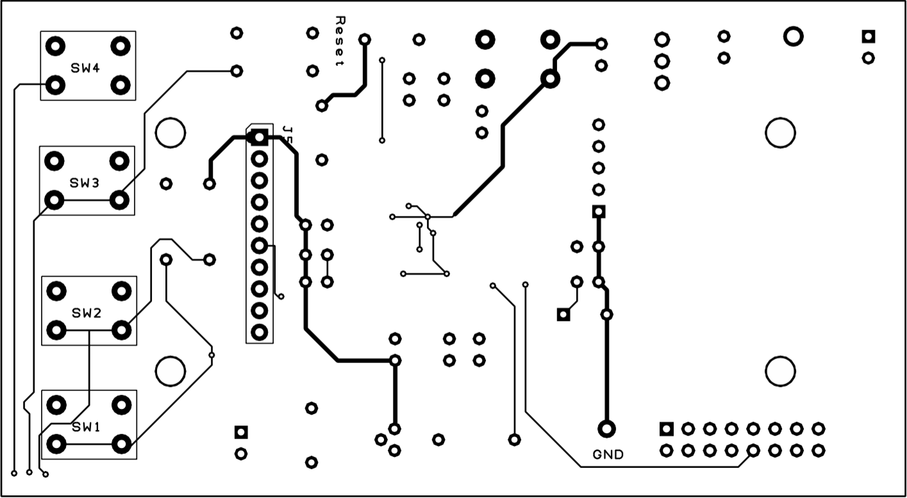
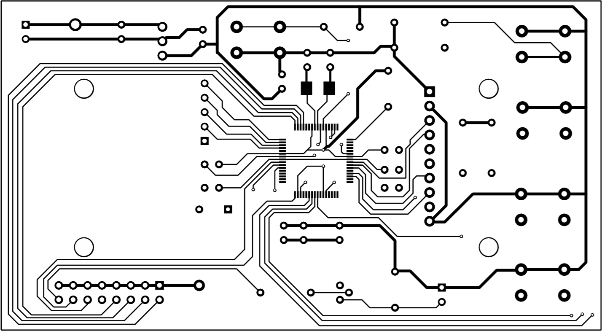
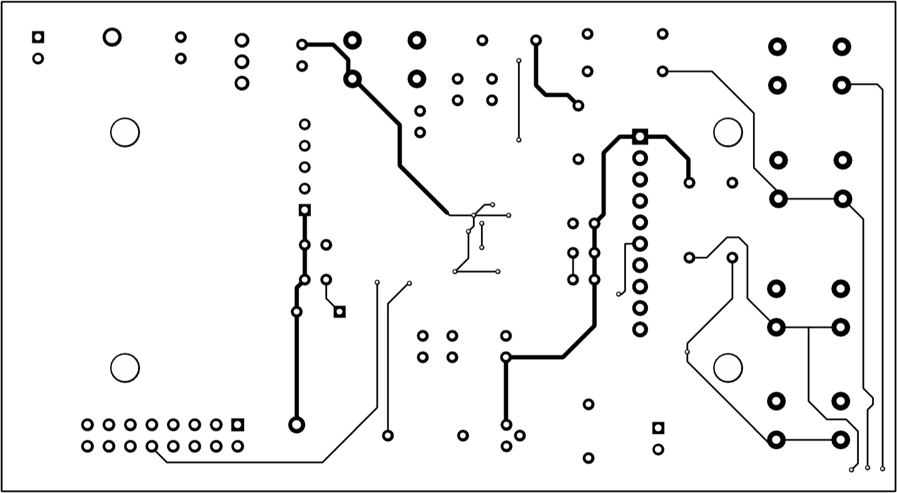

# Lab 6: Introduction to PCB Design

For this lab we will be designing and ordering a PCB version of our [Lab 3](../Lab3/README.md).

## Objectives

See our [Lab 3 requirements](Requirements.md).

## Hardware Design

We have chosen the Samsung Li-Ion 18650 Cylindrical 7.4V 2800mAh Flat Top Rechargeable Battery w/ PCM Protection as our battery for this PCB. Two of these in series should provide the proper voltage and enough current to last a while. And they're rechargeable so we can replace them with charged ones easily. We could use the following product: <http://www.tenergy.com/31444>

	
We have chosen to use a medium enclosure with enough space to house batteries. This case seems to fit the bill: <http://www.pactecenclosures.com/product-detail.php?productid=230&seriesid=38&classid=35>

### Our new component

<<<<<<<<<<<<<< insert 3-pages showing the new component we created and an example PCB using it >>>>>>>>>>>>>>

### Mechanical Drawings

<<<<<<<<<<<<<< insert 2 mechanical drawings >>>>>>>>>>>>>>

### Final Circuit Diagram

### Mockup

Top copper and silk screen

Bottom copper and silk screen

Top copper only

Bottom copper only

## Measurement Data

### Bill of Materials

### Why this battery?

After measuring our board while just powering our display, we reached a peak current usage of about 71mA. Additionally, while we were driving the speaker, the peak current usage is about 83mA. Therefore, if we were to run the alarm for 24 hours (max current usage) then we would have used about `83 mA * 24 hr = 1992 mAh`. This battery has a total storage of 2800 mAh which should be more than enough to account for error in our measurements and last a full 24 hours.

Since 7.4V is standard with their rechargeable batteries, we will be using a voltage regulator to adjust this down to an acceptable voltage.

## Analysis and Discussion

We will test our system by connecting a power supply to the test points for the battery. We can also test the GPIO pins on Port B for debugging as well as PE4 which sets the speaker to high and low via the logic analyzer port. The pins on port B will be used so that if we run into any problems we can just hook up those pins to important signals and flash that new program to the board.
