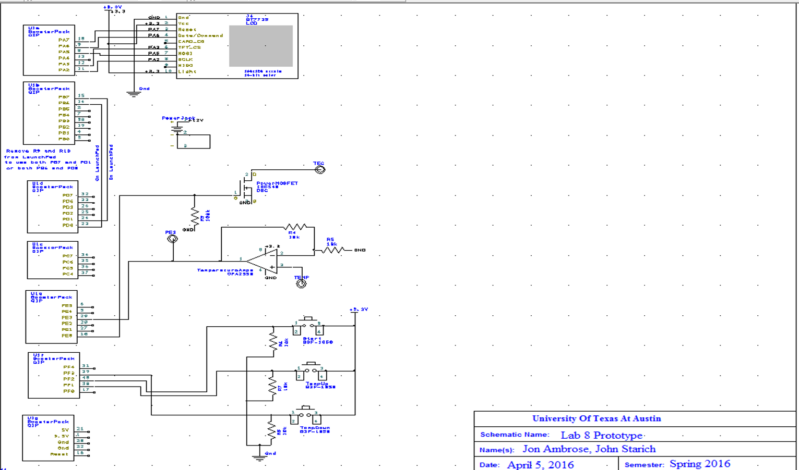

# Lab 8: Software Drivers for an Embedded System

## Objectives

See our [Requirements file](Requirements.md)

## Hardware Design



## Software Design

Our temperature initialization and interface code:

```c
#include <stdint.h>
#include "../inc/tm4c123gh6pm.h"

void ADC0_InitSWTriggerSeq3_Ch0(void){ 
  SYSCTL_RCGCADC_R |= 0x0001;   // 7) activate ADC0
  SYSCTL_RCGCGPIO_R |= 0x10;    // 1) activate clock for Port E
  while((SYSCTL_PRGPIO_R&0x10) != 0x10){}; // wait for clock on port
  GPIO_PORTE_DIR_R &= ~0x08;      // 2) make PE3 input
  GPIO_PORTE_AFSEL_R |= 0x08;     // 3) enable alternate function on PE3
  GPIO_PORTE_DEN_R &= ~0x08;      // 4) disable digital I/O on PE3
  GPIO_PORTE_AMSEL_R |= 0x08;     // 5) enable analog functionality on PE3

  ADC0_PC_R &= ~0xF;              // 7) clear max sample rate field
  ADC0_PC_R |= 0x1;               //    configure for 125K samples/sec
  ADC0_SSPRI_R = 0x0123;          // 8) Sequencer 3 is highest priority
  ADC0_ACTSS_R &= ~0x0008;        // 9) disable sample sequencer 3
  ADC0_EMUX_R &= ~0xF000;         // 10) seq3 is software trigger
  ADC0_SSMUX3_R &= ~0x000F;       // 11) clear SS3 field
  //ADC0_SSMUX3_R += 0;           // set channel to 0
  ADC0_SSCTL3_R = 0x0006;         // 12) no TS0 D0, yes IE0 END0
  ADC0_IM_R &= ~0x0008;           // 13) disable SS3 interrupts
  ADC0_SAC_R |= 0x6;              // enable x64 sampling
  ADC0_ACTSS_R |= 0x0008;         // 14) enable sample sequencer 3
}

uint32_t ADC0_InSeq3(void){
    uint32_t result;
    ADC0_PSSI_R = 0x0008;            // 1) initiate SS3
    while((ADC0_RIS_R&0x08)==0){};   // 2) wait for conversion done
    // if you have an A0-A3 revision number, you need to add an 8 usec wait here
    result = ADC0_SSFIFO3_R&0xFFF;   // 3) read result
    ADC0_ISC_R = 0x0008;             // 4) acknowledge completion
    return result;
}
```

Our thermoelectric cooler initialization and interface code:

```c
#include <stdbool.h>
#include "..//inc//tm4c123gh6pm.h"
#include <stdint.h>

int16_t TEC_Temp = 25;

void TEC_Init(void) {
        SYSCTL_RCGCGPIO_R |= 0x10;        // activate port E
        while((SYSCTL_PRGPIO_R & 0x0010) == 0){}; // wait for clock on port
        GPIO_PORTE_DIR_R |= 0x01;         // set PE0 as output
        GPIO_PORTE_AFSEL_R &= ~0x01;      // disable alternate functions on PE0
        GPIO_PORTE_DEN_R |= 0x01;         // enable digital IO on PE0
        
        GPIO_PORTE_PCTL_R = (GPIO_PORTF_PCTL_R & 0xFFFFFFF0)+0x0;
}

void TEC_Start(void){
        GPIO_PORTE_DATA_R |= 0x01;
}

void TEC_Stop(void){
        GPIO_PORTE_DATA_R &= ~0x01;
}

bool TEC_Status(void){
        return GPIO_PORTE_DATA_R & 0x01;
}

void TEC_Temp_Up(void){
        TEC_Temp += 1;
}
        
void TEC_Temp_Down(void){
        TEC_Temp -= 1;
}

int16_t TEC_Get(void){
        return TEC_Temp;
}
```

## Measurement Data

