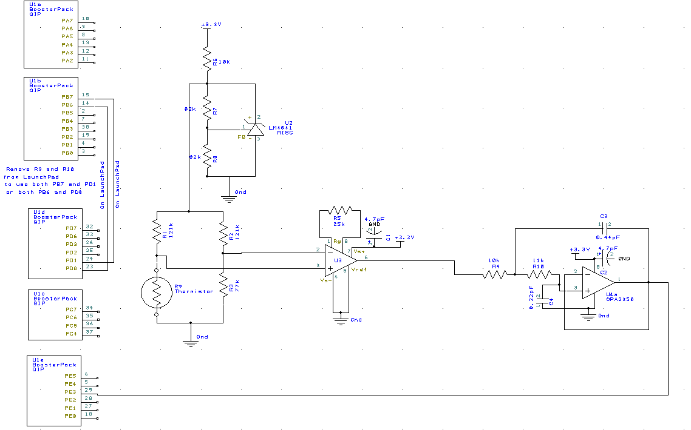
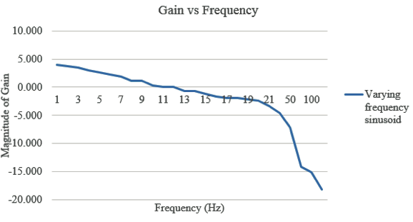

# Lab 9: Temperature Data Acquisition System

## Objectives

This experiment will use an ADC converter on the TM4C123 to construct a digital thermometer. The temperature range is 10 to 40°C. The measured temperature data will be displayed numerically as a fixed-point number on the LCD, using a 0.01 fixed-point format. The temperature versus time data will also be graphically plotted. Our temperature measurement resolution is to be 0.1°C or better. The average temperature accuracy should be 1°C or better. The frequency components of the signal are 0 to 10 Hz.

## Hardware Design



Hardware Schematic

## Software Design

### Calibration

We calibrated our resistor values for our thermistor and voltage regulator as follows:

Calibration measurements:

First point:  94.5kΩ at 25°C
Second point: 82.1kΩ at 36.03°C

R0 = 1.83kΩ

β = 1175.567

V1 = 2.47V

R1 = R2 = 121kΩ

R3 = 77kΩ

V3 = 0.961V

For INA122:

Rg = 24.51 ~= 25kΩ

Gain = 5 + 200kΩ / 25kΩ = 13.00

Range: 151 to 4045 on the ADC, 10 to 40°C

Resolution: ∆T = ~0.008°C

Our output conversion tables:

```c
uint16_t const ADCdata[53] = {
    0,151,219,288,357,427,497,567,638,709,781,                      
    853,925,998,1071,1144,1218,1292,1367,1441,1517,                        
    1593,1669,1745,1822,1899,1977,2055,2133,2212,2291,                     
    2371,2451,2531,2612,2693,2775,2857,2939,3022,3105,                     
    3189,3272,3357,3441,3527,3612,3698,3784,3871,3958,4045,4096
};

uint16_t const Tdata[53] = {
    4000,4000,3940,3880,3820,3760,3700,3640,3580,3520,3460,       
    3400,3340,3280,3220,3160,3100,3040,2980,2920,2860,     
    2800,2740,2680,2620,2560,2500,2440,2380,2320,2260,     
    2200,2140,2080,2020,1960,1900,1840,1780,1720,1660,     
    1600,1540,1480,1420,1360,1300,1240,1180,1120,1060,1000,1000
};

uint16_t const Rdata[53] = {
    7824,7824,7880,7937,7995,8054,8113,8173,8233,8294,8356,           
    8419,8482,8546,8611,8677,8743,8810,8878,8946,9016,         
    9086,9157,9229,9302,9375,9450,9525,9602,9679,9757,         
    9836,9917,9998,10080,10163,10247,10332,10419,10506,10594,          
    10684,10775,10866,10960,11054,11149,11246,11344,11443,11543,11645,11645
};
```

### Low level ADC interface

```c
int32_t fifo[FIFO_SIZE];
int32_t fifoStart = 0;
int32_t fifoEnd = 0;

void ADC0_InitTimerTriggerSeq3_Ch0(void) {
    volatile uint32_t delay;
    SYSCTL_RCGCADC_R |= 0x0001;     // activate ADC0
    SYSCTL_RCGCGPIO_R |= 0x10;      // 1) activate clock for Port E
    while((SYSCTL_PRGPIO_R&0x10) != 0x10); // wait for clock on port
    GPIO_PORTE_DIR_R &= ~0x08;      // 2) make PE3 input
    GPIO_PORTE_AFSEL_R |= 0x08;     // 3) enable alternate function on PE3
    GPIO_PORTE_DEN_R &= ~0x08;      // 4) disable digital I/O on PE3
    GPIO_PORTE_AMSEL_R |= 0x08;     // 5) enable analog functionality on PE3

    ADC0_PC_R &= ~0xF;              // 7) clear max sample rate field
    ADC0_PC_R |= 0x1;               //    configure for 125K samples/sec
    ADC0_SSPRI_R = 0x0123;          // 8) Sequencer 3 is highest priority

    // timer setup
    SYSCTL_RCGCTIMER_R |= 0x01;     // enable timer0
    delay = SYSCTL_RCGCGPIO_R;      // delay
    TIMER0_CTL_R = 0x0;             // disable timer
    TIMER0_CTL_R |= 0x020;          // enable timer0 to trigger ADC
    TIMER0_CFG_R = 0;               // configure for 32-bit timer mode
    TIMER0_TAMR_R = 0x02;           // configure for periodic mode
    TIMER0_TAPR_R = 0;              // prescale value for trigger
    TIMER0_TAILR_R = 0x1387F;       // reload time (period)
    TIMER0_IMR_R = 0x0;             // disable all interrupts
    TIMER0_CTL_R |= 0x01;           // enable timer0A 32-b, periodic

    ADC0_ACTSS_R &= ~0x0008;        // 9) disable sample sequencer 3
    ADC0_EMUX_R = (ADC0_EMUX_R & ~0x0F000) | 0x05000;  // 10) seq3 is software trigger
    ADC0_SSMUX3_R &= ~0x000F;       // 11) clear SS3 field
    //ADC0_SSMUX3_R += 0;           // set channel to 0
    ADC0_SSCTL3_R = 0x0006;         // 12) no TS0 D0, yes IE0 END0
    ADC0_IM_R |= 0x0008;                      // 13) disable SS3 interrupts
    ADC0_SAC_R |= 0x6;              // enable x64 sampling
    ADC0_ACTSS_R |= 0x0008;         // 14) enable sample sequencer 3
    
    NVIC_PRI4_R = (NVIC_PRI4_R & ~0x0FF00) | 0x04000; // timer0 priority 2
    NVIC_EN0_R = 1 << 17;           // enable interrupt 17 in NVIC
    
    // "zero" out with bad data (-1)
    for(int i = 0; i < FIFO_SIZE; i += 1) {
        fifo[i] = -1;
    }
}

void ADC_FIFO_Push(int32_t data) {
    int32_t nextFifoEnd = (fifoEnd + 1) % FIFO_SIZE;
    if(nextFifoEnd == fifoStart) {
        return;
    }
    fifoEnd = nextFifoEnd;
    fifo[fifoEnd] = data;
}

int32_t ADC_FIFO_Pop(void) {
    if(fifoStart == fifoEnd) {
        return -1;
    }
    int32_t poppedValue = fifo[fifoStart];
    fifoStart = (fifoStart + 1) % FIFO_SIZE;
    return poppedValue;
}

void ADC0Seq3_Handler(void){
    ADC0_ISC_R = 0x0008;
    uint32_t result = ADC0_SSFIFO3_R&0xFFF;
    if((fifoStart + 1) % FIFO_SIZE == fifoEnd) {
        ADC_FIFO_Pop();
    }
    ADC_FIFO_Push(result);
}

int32_t* ADC_FIFO_Get(void) { return fifo; }

int32_t ADC_FIFO_CurrentValue(void) { return fifo[fifoStart]; }
```

### Main program

```c
int main(void) {
    DisableInterrupts();
    PLL_Init(Bus80MHz); // bus clock at 80 MHz
    UART_Init();
    ST7735_InitR(INITR_REDTAB);
    ADC0_InitTimerTriggerSeq3_Ch0();

    EnableInterrupts();

    while(1) {
        ST7735_SetCursor(0, 0);
        int32_t currentTemperature = Temperature_Convert(ADC_FIFO_CurrentValue());
        printf("Temperature %5d.%02d\n", currentTemperature / 100, currentTemperature % 100);
        ST7735_PlotClear(32, 159);
        
        for(int i = 0; i < FIFO_SIZE; i += 1) {
            int32_t point = 128 - Temperature_Convert(ADC_FIFO_Get()[i]) * 2 / 100;
            ST7735_DrawPixel(i+1, point+1, ST7735_RED);
            ST7735_DrawPixel(i+1, point, ST7735_RED);
            ST7735_DrawPixel(i, point+1, ST7735_RED);
            ST7735_DrawPixel(i, point, ST7735_RED);
        }
        WaitForInterrupt();
    }
}
```

## Measurement Data


| R (kΩ) |     | Vs (V) | V2 (V) | V2 - V3 (V) |
| ------ | --- | ------ | ------ | ----------- |
| 115    | Min | 2.762  | 0.984  | 0.064       |
|        | Max | 2.985  | 1.188  | 0.220       |
| 100    | Min | 2.027  | 1.098  | 0.137       |
|        | Max | 2.040  | 1.118  | 0.157       |
| 90     | Min | 1.206  | 0.942  | 0.031       |
|        | Max | 1.223  | 1.055  | 0.094       |
| 80     | Min | 0.265  | 0.906  | 0.006       |
|        | Max | 0.344  | 0.987  | 0.026       |
| open   | Min | 3.14   | 2.12   | 1.93        |
|        | Max | 3.26   | 2.24   | 2.08        |
| short  | Min | -0.09  | -0.14  | -0.4        |
|        | Max | 0.09   | 0.14   | -0.09       |



| True temp (°C) | Measured Temp (°C) | Difference |
| -------------- | ------------------ | ---------- |
| 33.1           | 34.6               | 1.5        |
| 33.1           | 35.2               | 2.1        |
| 33.1           | 35.4               | 2.3        |
| 33.1           | 35.1               | 2.0        |
| 33.1           | 34.8               | 1.7        |
| 33.1           | 35.0               | 1.9        |

Average difference: 1.92

|             | T            | T²      |
| ----------- | ------------:| -------:|
|             | 29.28        | 857.318 |
|             | 29.31        | 859.076 |
|             | 29.34        | 860.836 |
|             | 29.30        | 858.490 |
|             | 29.28        | 857.318 |
|             | 29.32        | 859.662 |
|             | 29.27        | 856.733 |
|             | 29.26        | 856.148 |
|             | 29.25        | 855.563 |
|             | 29.28        | 857.318 |
| Expectation | 29.29        | 857.846 |
| Var(T)      | 0.000709     |         |
| Std Dev     | 0.026627054  |         |

## Analysis and Discussion

1. The Nyquist theorem refers to the minimum sampling frequency required to capture the original waveform through data sampling and the waveform still retain its shape. It states the sampling frequency must be at least twice that of the input frequency. In this lab, we had to sample at least twice our input frequency (10Hz) so we needed to sample at 20Hz or greater.
2. Resolution is the smallest step of change in value in a system. Accuracy refers to the correctness of information captured. In our temperature acquisition system where temperature information is converted to voltage values by thermistor and acquired by analog-to-digital conversion interface, resolution in the digital system refers to the voltage changes by number of discrete digital inputs of the microcontroller. Accuracy is the variance between acquired temperature information in the digital system and the actual environmental temperature information measured by most other devices.
3. .
4. ​Low pass filter is used for removing high frequency noise that may be present in the captured temperature waveform. Potential sources of noise include the power line interference (at 60Hz) and its harmonics.
5. .
6. The linear method was not chosen because of the error that would have occurred when trying to represent the nonlinear relationship the temperature and ADC values. A large lookup table is better because it takes less time to just look up a temperature from an ADC value, rather than interpolating or using a formula to calculate a temperature. One drawback is the large amount of space the lookup tables take up. However, for this lab, this memory space usage was not an issue. So a linear equation (or equation of any sort) would require little to no space in memory, and would be better in this way.
